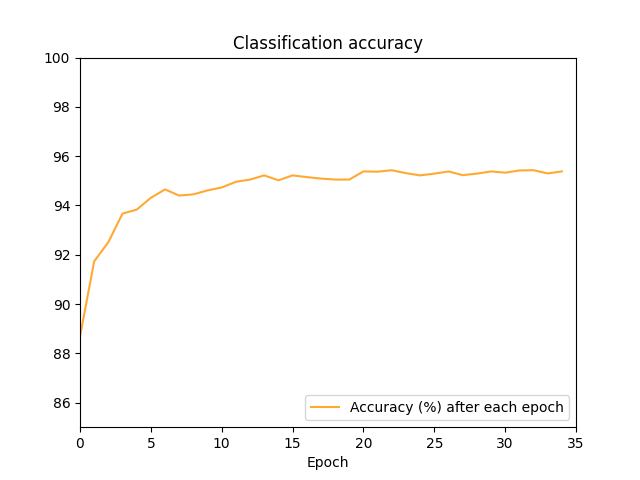
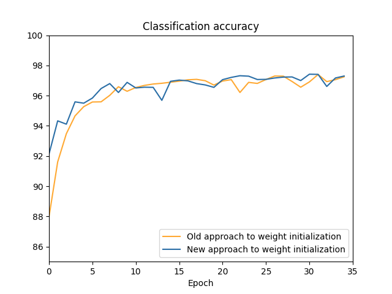
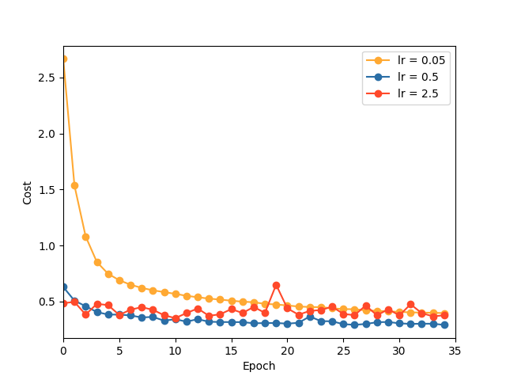
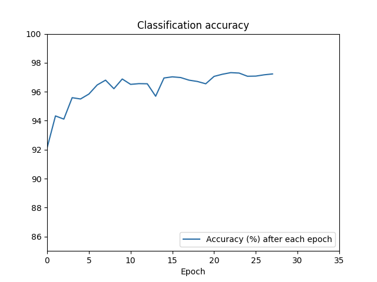

# Build Neural Network with MNIST database
This repository contains code for the construction of basic neural networks from scratch. Dataset used is the MNIST digits database.

## Installation Guide

## Overview
With the hyperparameters specified in hyperparams.py:

Network V1: 95.12% success rate

Network V2.0: 97.24% success rate

Results can but emulated by running test.py

## Graphical evaluation
### Version 1
Conventional implementation of a neural network with sigmoid function and quadratic cost function:

### Version 2
1. Observe the impact of scaling the initialized weights by 1/sqrt(n) where n is the number of input weights:
    * 
    * Notice that while both eventually converge to the same accuracy results, it appears as though the graph using the older approach is trailing that of the new graph. This technique of initializing weights become more pronounced and significant when training even larger datasets with high expected number of training epochs required (
    [network prefers learning small weights](https://datascience.stackexchange.com/questions/29682/understanding-regularisation-and-a-preference-for-small-weights)).

2. Exploring suitable parameters
    * 
    One, albeit costly way to determine hyperparameters is to simply test different values of a particular parameter while keeping the others a constant. Above shows different cost curves with different learning_rates. A similar method can be used to determine suitable size of mini batch for the network to update itself as well as regularization parameter.

3. Network2 implemented with early stopping
    * 

## Resources & Credits
Referenced ["Neural Networks and Deep Learning"](http://neuralnetworksanddeeplearning.com).

**Note**: Some of the contents in this repository was originally forked from ["neural-networks-and-deep-learning"](https://github.com/mnielsen/neural-networks-and-deep-learning) by Michael Nielson but all the files were eventually shifted to a personal repository given vast personal changes.

Implementation of some parts may differ significantly from author's to ensure:

a) Further optimization

b) Additional features

c) Compatiblity with Python3

d) My own learning!

