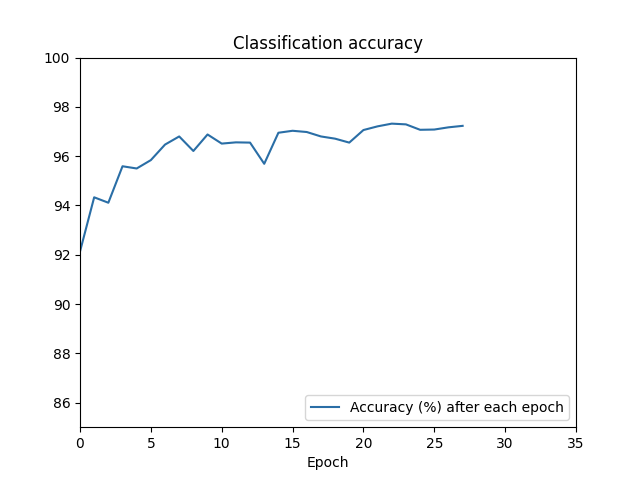

# Network 2.2 with Early Stopping 

**Success rate of sample model: 97.24%**

Early stopping allows the model to halt training after not seeing further improvements to its existing best result after a given number of epochs. This is useful especially when training a model for the first time with no good estimate on the suitable number of epochs. 

However, the risk, especially for deep-layered models, is that the model may plateu in performance for several epochs before starting to show signs of improvement again which which may not be captured if the threshold for early stopping is small.

