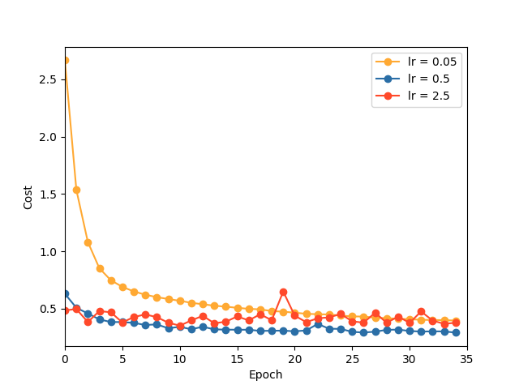

# Network 2.1 Different Learning Rates 

Using Network 2.1 (L2 reg + cross-entropy cost), explore the effects of different learning rates and note performance for the extreme ends:

One, albeit costly, way to determine hyperparameters is to simply test different values of a particular parameter while keeping the others constant. Above shows different cost curves with different learning_rates. 

A similar method can be used to determine suitable value for regularization parameter or size of mini batch to be processed before the network to update itself (This was how I roughly gauged the parameters specified in hyperparms.py in the root folder!). 

