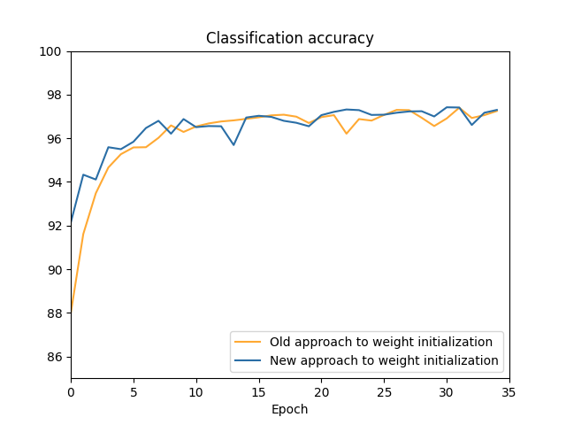

# Network 2.1 Comparing Different Weight Initializations

Scale factor: Initalized weights are scaled by **1/sqrt(n)** where n is the number of input weights.

**Success rate with scaled (aka default) initialized weights: 97.15%**

**Success rate with unscaled (simply randomized, i.e network 2.0) initialized weights: 96.91%**

Note: The success rate for the latter (unscaled version) should be the same as that of Network's 2.0 which coincidentally happens to be 97.15% as well. The disparity here is due to running both networks in one program and so even though the same random seed is used, the numbers generated for the unscaled weights are in different order from that in in [network 2.0](../view_learning2/)

Notice that while both eventually converge to the same accuracy results, it appears as though the graph using the older approach is trailing that of the new graph. 

This technique of initializing weights becomes more pronounced (since neurons are less likely to saturate) and significant, in saving time,  when training even larger datasets with high expected number of training epochs required (
    [network prefers learning small weights](https://datascience.stackexchange.com/questions/29682/understanding-regularisation-and-a-preference-for-small-weights)
    ).